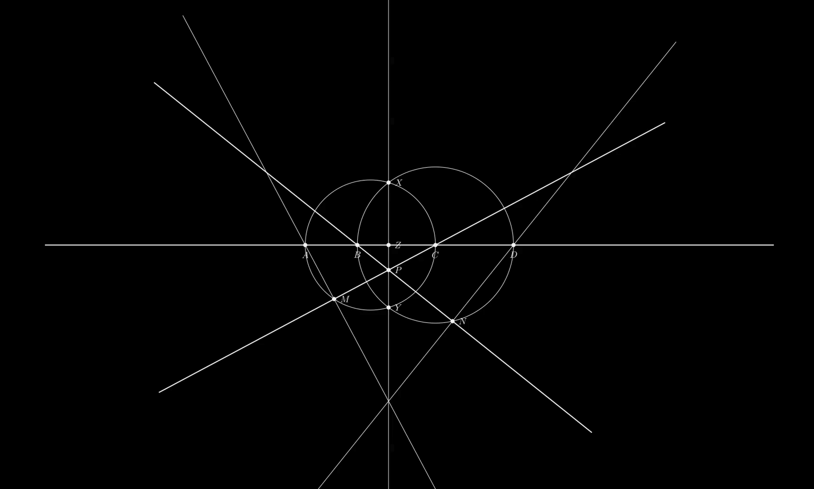

# Initial prompt

Given the following geometry problem, generate steps to draw the diagram for the problem, then generate Manim code to animate the diagram, and briefly highlight any shapes that are mentioned in the question. Briefly pause between steps. Do not show any unmentioned information or answers on the diagram.

Problem: Let A, B, C, D be fore distinct points on a line, in that order. The circles with diameter AC and BD intersect at X and Y. The line XY meets BC at Z. Let P be a point on the line XY other than Z. The line CP intersects the circle with diameter AC at C and M, and the line BP intersects the circle with diameter BD at B and N. Prove that the lines AM, DN, XY are concurrent.

==**ChatGPT Summary**==

ChatGPT created step-by-step plan and implement the code.

==**Result**==

The code worked, but coordinates are wrong.

# User 2

The generated animation has the following problems:

- The circles are at wrong places
- Intersections (X, Y, Z, M, N) are at the wrong places and not the actual intersections

==**ChatGPT Summary**==

ChatGPT response change summary:

- Replaced fake geometry with **actual geometric computation**
    
- Used:
    
    - `Intersection(...)` for circle–circle and line–circle intersections
    - `line_intersection(...)` for Z
- Ensured:
    
    - **M ≠ C**, **N ≠ B** (correct second intersection selection)

This produces a geometrically correct diagram aligned with the problem statement.

==**Result**==

`IndexError: list index out of range`

# User 3

The generated code produce the following error:

(omitted traceback)

IndexError: list index out of range

==**ChatGPT Summary**==

The error occurs because `Intersection(circle1, circle2)` in Manim **does not return multiple discrete points**. It returns a single VMobject representing the intersection set, so indexing like `inters[1]` fails.

You need to compute intersections **analytically**, not via `Intersection`.

## Correct Approach

* Compute circle–circle intersections manually
* Compute line–circle intersections manually
* Then create `Dot` objects from those coordinates

(omitted code)

## Why This Works

* No reliance on Manim’s unreliable `Intersection` indexing
* All intersections are **mathematically correct**
* Guarantees:

  * exactly 2 points for circle–circle
  * correct “second intersection” for M, N

==**Result**==

Code worked, but has problem below.

# User 4

The generated animation has the following problems:
\- Points' name are not showing
\- Lines are truncated and do not show extensions to intersections
\- The question are not indicated/highlighted

==**ChatGPT Summary**==

## Key Fixes

* Use `MathTex` for clear point labels and ensure `FadeIn/Write` is applied
* Use a helper to draw **extended lines** (not truncated segments)
* Add **brief highlight animations** for all objects explicitly mentioned

## What This Fixes

* **Labels visible**: all points use `MathTex` + explicit `Write`
* **Lines not truncated**: all key lines use `extend_line(...)`
* **Correct intersections**: fully analytic (no Manim shortcuts)
* **Problem elements highlighted**:

  * both circles
  * line XY
  * points M, N
  * lines AM, DN

==**Result**==

Code work, animation acceptable, but cropped. Labeling issue still persists.

# User 5

The generated animation has the following problems:
\- Scene is cropped and not show full diagram

==**ChatGPT Summary**==

The cropping issue is caused by Manim’s default camera frame being too small relative to the constructed geometry (especially with extended lines). You need to explicitly **scale and center the camera frame** to fit the entire diagram.

## Fix Strategy

* Compute all key points first
* Determine bounding box
* Move and scale the camera frame to fit everything with padding

## What This Fixes

* Camera automatically:

  * **centers on the full construction**
  * **zooms out to include all geometry**
* No cropping even with long extended lines
* Works robustly regardless of point configuration

==**Result**==

`AttributeError: 'Camera' object has no attribute 'frame'`

# User 6

The generated code produces the following error:

(omitted traceback)

AttributeError: 'Camera' object has no attribute 'frame'

==**ChatGPT Summary**==

* Cause: `Scene` → no `camera.frame`
* Fix: switch to `MovingCameraScene`
* Result: camera fitting works correctly, no cropping

==**Result**==

Code worked, but still not fix issues.

# User 7

Always generate full code.

After using recommended solution, the generated animation has the following problems:
\- Points' names are missing
\- Diagram is cropped

==**ChatGPT Summary**==

* Use `MovingCameraScene`
* Compute **bounding box from ALL geometry** (circles + extended lines)
* Use `self.camera.frame.animate.set(...)` (more reliable than direct set)
* Ensure **labels are explicitly written and positioned after camera adjustment**
* Use `add_foreground_mobjects(labels)` to prevent them disappearing behind shapes

## What This Fixes

### Missing Labels

* Explicit `Write(labels[i])`
* Labels added to foreground → never hidden

### Cropping

* Camera fits **entire geometry group**, not just points
* Includes:

  * extended lines
  * circles
  * all intersection points

==**Result**==

`TypeError: 'MathTex' object is not callable`

# User 8

The generated code produces the following error:

(omitted traceback)

TypeError: 'MathTex' object is not callable

==**ChatGPT Summary**==

The error is caused by incorrect usage of `Write`:

```python
self.play(Write(labels[4], labels[5]))
```

`Write` accepts **one mobject**, not multiple. Passing multiple arguments makes Manim treat the second one incorrectly, leading to:

```
TypeError: 'MathTex' object is not callable
```

---

## Fix

Replace every occurrence like this:

```python
self.play(Write(labels[4], labels[5]))
```

with either:

```python
self.play(Write(labels[4]), Write(labels[5]))
```

or:

```python
self.play(Write(VGroup(labels[4], labels[5])))
```

==**Result**==

Code worked, but diagram flashed at the start, and question not highlighted.

# User 9

The generated animation has the following problems:
\- The diagram are shown briefly at the start of the animation
\- The question is not highlighted

==**ChatGPT Summary**==

## Fix Strategy

### 1. Prevent flash at start

Do **not add geometry to the scene** for camera fitting.
Instead:

* Use a temporary `VGroup` (not added)
* Compute bounds manually
* Move camera before any rendering

### 2. Proper highlighting of “question elements”

Explicitly highlight:

* Both circles
* Line XY
* Points M and N
* Lines AM and DN

Use short color transitions only (no clutter)

==**Result**==

Cropping issue returned. Highlight not enough objects.

# User 10

The generated animation has the following problems:
\- The diagram is cropped
\- The question is not sufficiently highlighted

==**ChatGPT Summary**==

## Fix Strategy

### 1. Robust Camera Fit (no cropping)

* Build all geometry first (without rendering)
* Use a `VGroup` bounding box including:

  * circles
  * extended lines
  * points
* Fit camera to that group

### 2. Stronger Highlighting

Add **structured highlighting phases**:

* Circles (AC, BD)
* Line XY
* Intersection points (X, Y, Z)
* Constructed points (M, N)
* Final lines (AM, DN)

Use:

* thicker stroke
* color change
* short pauses

==**Result**==


