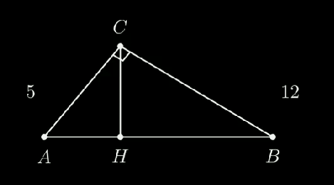

==**User**==

Given the following geometry problem, generate steps to draw the diagram for the problem, then generate Manim code to animate the diagram. Do not show any unmentioned information or answers on the diagram.

Problem: Triangle ABC is right-angled at C with AC = 5 cm and BC = 12 cm. The altitude from C meets AB at H. Find the lengths AH, HB, and CH.

 

==**ChatGPT**==

### Steps to draw the diagram

1. Draw a horizontal line segment and mark two points (A) (left) and (B) (right).
2. Construct point (C) such that triangle (ABC) is right-angled at (C):

   * From (A), draw a segment of length 5 cm in an upward direction.
   * From (B), draw a segment of length 12 cm toward the point that meets the endpoint of the 5 cm segment.
   * Ensure (\angle ACB = 90^\circ).
3. Connect (A) to (C) and (B) to (C) to form triangle (ABC).
4. Draw the hypotenuse (AB).
5. From point (C), draw a perpendicular line to (AB). Mark the intersection point as (H).
6. Label all points: (A, B, C, H).
7. Label the given side lengths (AC = 5) cm and (BC = 12) cm.
8. Do not include any computed lengths or angle values beyond the right angle at (C).

==**Result**==

