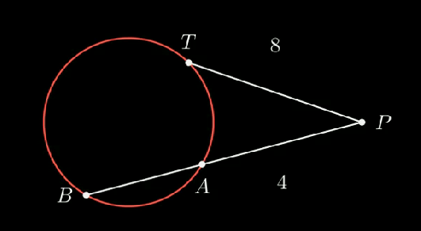

==**User**==

Given the following geometry problem, generate steps to draw the diagram for the problem, then generate Manim code to animate the diagram. Do not show any unmentioned information or answers on the diagram.

Problem: A tangent and a secant are drawn from an external point P to a circle. The tangent touches the circle at T, and the secant passes through the circle meeting it at points A and B (with A between P and B). Given PT = 8 cm and PA = 4 cm, find the length PB.

 

==**ChatGPT**==

**Steps to draw the diagram**

1.  Draw a circle with center (O).
    
2.  Mark a point (P) outside the circle.
    
3.  Draw a tangent from (P) to the circle, touching it at point (T).
    
4.  Draw a secant from (P) that intersects the circle at two points:
    
    - First intersection: (A) (closer to (P))
        
    - Second intersection: (B) (farther from (P))
        
5.  Label all points: (P, T, A, B).
    
6.  Mark the segment (PT) and label it (8\\ \\text{cm}).
    
7.  Mark the segment (PA) and label it (4\\ \\text{cm}).
    
8.  Do **not** include any computed lengths or answers on the diagram.

==**Result**==

