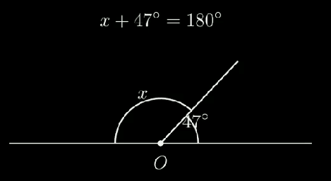

# Initial prompt

Given the following geometry problem, generate steps to draw the diagram for the problem, then generate Manim code to animate the diagram.

Problem: Two angles are supplementary. One angle measures 47 degrees. What is the measure of the other angle?

==**ChatGPT**==

### Steps to Draw the Diagram

1.  Draw a straight horizontal line (this represents a straight angle of 180°).
2.  Mark a point in the middle of the line (call it point $O$).
3.  From point (O), draw a ray upward at an angle (this splits the straight line into two adjacent angles).
4.  Label the angle on one side as $47^\circ$.
5.  Label the other adjacent angle as $x$.
6.  Indicate that the two angles form a straight line (supplementary), so their sum is $180^\circ$.

* * *

### Key Relationship

Supplementary angles satisfy:

$$
x + 47^\circ = 180^\circ  
$$

$$
x = 180^\circ - 47^\circ = 133^\circ  
$$

* * *

### Manim Code (Animation)

(omitted)

* * *

This animation:

- Builds the straight line and ray
- Visually shows the two supplementary angles
- Displays the equation and solution step-by-step

 

# User 2

The generated code has the following problems:  
 \- Do not show answers on diagram  
 \- The angle notation for x is at wrong side

 

==**ChatGPT**==

### Fixes Applied

- Removed the solution display (`x = 133°`) from the animation.
- Corrected the placement of the (x) label so it clearly sits inside the larger supplementary angle (133° side), not the 47° side.

* * *

### Updated Manim Code

(omitted)

* * *

### What Changed Conceptually

- The larger angle is explicitly constructed using `other_angle=True`, ensuring it represents the supplementary region.
- The $x$ label is positioned using that larger angle’s geometry, preventing it from appearing on the wrong side.
- The animation now focuses purely on setup (diagram + equation), not the solution.

 

# User 3

The generated code has the following problems:
 - The angle notation for x cover the whole outer circle clockwise

 

==**ChatGPT**==

The issue comes from using `other_angle=True`, which makes Manim draw the reflex angle (almost the full circle). For supplementary angles, you only want the **upper semicircle (133°)**, not the full outer sweep.

### Fix

Define the two angles explicitly using **two half-lines**:

- Left horizontal ray
- Right horizontal ray
- Slanted ray (47°)

Then:

- $47^\circ$ = angle between **right ray → slanted ray**
- $x$ = angle between **slanted ray → left ray** (this gives 133°, not the reflex angle)

* * *

### Corrected Manim Code

(omitted)

* * *

### Why This Works

- Avoids `other_angle=True`, which caused the full circular sweep.
- Constructs the **correct 133° interior angle** directly.
- Ensures $x$ sits cleanly in the supplementary region without wrapping around the circle.

 

==**Result**==

